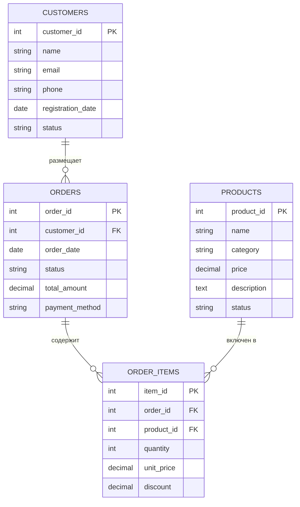

# Логическая модель данных

## Основные сущности

### Клиенты (Customers)
**Описание:** Организации и физические лица, которые являются клиентами компании

**Атрибуты:**
- ID клиента (PK)
- Наименование
- Тип клиента (B2B/B2C)
- Контактная информация
- Дата регистрации
- Статус

### Продукты (Products)
**Описание:** Товары и услуги, которые продает компания

**Атрибуты:**
- ID продукта (PK)
- Название
- Категория
- Цена
- Описание
- Статус (активный/архивный)

### Заказы (Orders)
**Описание:** Заказы, размещенные клиентами

**Атрибуты:**
- ID заказа (PK)
- ID клиента (FK)
- Дата заказа
- Статус заказа
- Общая сумма
- Способ оплаты

### Позиции заказа (Order Items)
**Описание:** Детализация заказов по продуктам

**Атрибуты:**
- ID позиции (PK)
- ID заказа (FK)
- ID продукта (FK)
- Количество
- Цена за единицу
- Скидка

## Связи между сущностями

## Бизнес-правила

### Клиенты
- Каждый клиент должен иметь уникальный email
- Статус клиента влияет на возможность размещения заказов
- При регистрации клиент получает статус "prospect"

### Заказы
- Заказ не может быть создан без позиций
- Общая сумма заказа = сумма всех позиций
- Статусы заказа: draft → confirmed → paid → shipped → delivered

### Продукты
- Цена продукта не может быть отрицательной
- Архивные продукты нельзя добавлять в новые заказы
- Категория продукта обязательна

## Индексы и производительность

### Рекомендуемые индексы
- `customers.email` (unique)
- `orders.customer_id, orders.order_date`
- `order_items.order_id`
- `order_items.product_id`
- `products.category, products.status`

### Партиционирование
- Таблица `orders` — по дате заказа (месячное)
- Таблица `order_items` — по дате заказа (месячное)

## Архивирование данных
- Заказы старше 7 лет → архивная база
- Клиенты без активности > 3 года → пометка для архивирования
- Логи системы старше 1 года → удаление
