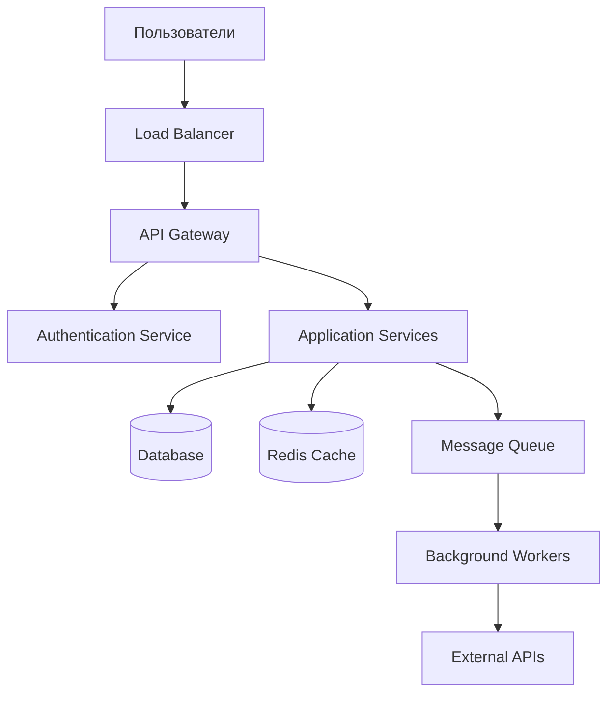

# Обзор архитектуры системы

## Высокоуровневая архитектура

## Компоненты системы

### Фронтенд
- **Технология:** React.js / Vue.js
- **Назначение:** Пользовательский интерфейс
- **Особенности:** SPA, responsive design

### API Gateway
- **Технология:** Kong / AWS API Gateway
- **Назначение:** Единая точка входа для всех API
- **Функции:** 
  - Маршрутизация запросов
  - Аутентификация и авторизация
  - Rate limiting
  - Логирование и мониторинг

### Application Services
- **Технология:** Python FastAPI / Node.js Express
- **Архитектурный стиль:** Microservices
- **Сервисы:**
  - User Service (управление пользователями)
  - Analytics Service (аналитика)
  - Reporting Service (отчеты)
  - Notification Service (уведомления)

### База данных
- **Основная БД:** PostgreSQL (OLTP)
- **Аналитическая БД:** ClickHouse (OLAP)
- **Кеш:** Redis
- **Поиск:** Elasticsearch

### Message Queue
- **Технология:** RabbitMQ / Apache Kafka
- **Назначение:** Асинхронная обработка задач
- **Паттерны:** Pub/Sub, Work Queues

## Принципы архитектуры

### Scalability (Масштабируемость)
- Горизонтальное масштабирование сервисов
- Шардинг базы данных по необходимости
- CDN для статических ресурсов

### Reliability (Надежность)
- Circuit Breaker паттерн
- Retry механизмы с exponential backoff
- Health checks для всех сервисов
- Graceful shutdown

### Security (Безопасность)
- OAuth 2.0 / JWT токены
- HTTPS везде
- Rate limiting
- Input validation
- SQL injection protection

### Observability (Наблюдаемость)
- Structured logging (JSON)
- Distributed tracing (Jaeger)
- Metrics collection (Prometheus)
- Error tracking (Sentry)

## Deployment

### Контейнеризация
- Docker для всех сервисов
- Multi-stage builds
- Минимальные base images (Alpine)

### Оркестрация
- Kubernetes для production
- Docker Compose для development
- Helm charts для развертывания

### CI/CD Pipeline
1. Code commit → Git webhook
2. Run tests (unit, integration)
3. Build Docker images
4. Security scanning
5. Deploy to staging
6. Run E2E tests
7. Deploy to production (blue-green)

## Мониторинг и алертинг

### Метрики
- **Business metrics:** конверсия, выручка, активные пользователи
- **Application metrics:** response time, throughput, error rate
- **Infrastructure metrics:** CPU, memory, disk, network

### Алерты
- **Critical:** система недоступна, потеря данных
- **Warning:** высокая нагрузка, медленные запросы
- **Info:** деплой завершен, плановые работы

## Планы развития

### Краткосрочные (3 месяца)
- [ ] Внедрение мониторинга производительности
- [ ] Оптимизация запросов к БД
- [ ] Добавление кеширования

### Среднесрочные (6 месяцев)
- [ ] Миграция на микросервисы
- [ ] Внедрение event-driven архитектуры
- [ ] Автоматизация тестирования

### Долгосрочные (12 месяцев)
- [ ] Переход на cloud-native архитектуру
- [ ] Внедрение machine learning pipeline
- [ ] Международная экспансия (multi-region)
